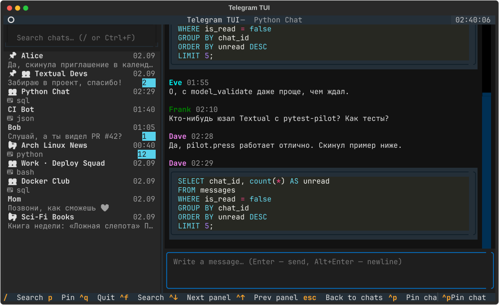

# telegram-tui

Терминальный клиент для Telegram на [Textual](https://textual.textualize.io/).
Работает на **mock-engine** — полной симуляции активности аккаунта — поэтому
клиент можно запустить и тестировать прямо сейчас, без реальной авторизации.



## Запуск

```bash
python -m venv .venv && source .venv/bin/activate
pip install -r requirements.txt
pip install -e .
telegram-tui          # или: python -m telegram_tui
```

## Интерфейс — три панели

| Панель | Что умеет |
|---|---|
| Слева: список чатов | поиск (`/` или `Ctrl+F`), пины (`Ctrl+P`), счётчик непрочитанных (циановый бейдж), превью последнего сообщения, иконки типа (группа/канал) |
| Центр: история сообщений | скролл, подсветка синтаксиса кода (fenced ``` блоки), цитаты-ответы (`↱`) |
| Внизу: поле ввода | многострочное (`Alt+Enter` — перенос строки, `Ctrl+G` — увеличить/уменьшить) |

## Режимы работы: Mock и Live (Telethon)

`telegram-tui` поддерживает два режима:

1. **`mock` (по умолчанию)**: офлайн-симуляция аккаунта с 10 чатами, входящим трафиком и автоответами собеседников. Работает «из коробки» без авторизации.
2. **`live`**: подключение к реальному Telegram через Telethon с авторизацией прямо в терминале.

### Настройка Live-режима

1. Получите `api_id` и `api_hash` на [my.telegram.org](https://my.telegram.org).
2. Создайте файл `config.toml` (в текущей директории или `~/.config/telegram-tui/config.toml`):

```toml
mode = "live"
api_id = 12345678
api_hash = "0123456789abcdef0123456789abcdef"
session = "telegram-tui"

# Медиа-инструменты (опционально)
media_player = "mpv"     # проигрыватель голосовых сообщений
photo_renderer = "chafa" # рендер превью фото прямо в терминале
```

Либо задайте через переменные окружения:
```bash
export TG_TUI_MODE=live
export TG_TUI_API_ID=12345678
export TG_TUI_API_HASH=0123456789abcdef0123456789abcdef
```

3. Запустите `telegram-tui`. Появится модальное окно авторизации:
   - Введите номер телефона (`+7999...`) → `Enter`.
   - Введите код подтверждения из Telegram/SMS → `Enter`.
   - При наличии 2FA введите облачный пароль (ввод скрыт) → `Enter`.
   - Сессия сохраняется локально в файл `telegram-tui.session`.

---

## Медиа в терминале

- **Голосовые сообщения**: выберите сообщение и нажмите `v` — голосовое проиграется в фоне через `mpv`.
- **Фото**: при наличии утилиты `chafa` превью изображений отображается прямо в ленте сообщений (автоматически выбирается протокол Kitty graphics, Sixel или Unicode half-blocks в зависимости от вашего терминала).

---

## Горячие клавиши

| Клавиша | Действие |
|---|---|
| `Enter` | отправить сообщение |
| `Alt+Enter` | перенос строки в поле ввода |
| `Ctrl+↑ / Ctrl+↓` | переключение панелей (список → история → ввод) |
| `Ctrl+F`, `/` (в списке) | полнотекстовый поиск по чатам |
| `j / k` (в списке) | перемещение вверх / вниз по чатам (Vim) |
| `j / k` (в истории) | перемещение по сообщениям |
| `gg / G` (в истории) | перейти к первому / последнему сообщению |
| `r` (в истории) | быстрый ответ на выбранное сообщение с цитатой |
| `v` (в истории) | воспроизвести голосовое сообщение через `mpv` |
| `/` (в истории) | поиск текста внутри открытого диалога |
| `n / N` (при поиске) | следующий / предыдущий результат поиска |
| `Esc` | сбросить поиск / отменить ответ / закрыть окно |
| `Ctrl+P` | закрепить/открепить выбранный чат 📌 |
| `Ctrl+M` | пометить чат прочитанным |
| `Ctrl+U` | сэмулировать входящее сообщение (в mock-режиме) |
| `Ctrl+Q` | выход |

---

## Тесты

```bash
pytest
```

Все **52 теста** проходят успешно:
- `test_engine.py`: юнит-тесты генератора, тиков, поиска и детерминированности mock-движка.
- `test_config.py`: валидация TOML, переменных окружения, режимов и учетных данных.
- `test_media.py`: интеграция с `mpv`, автоопределение терминальных протоколов `chafa`.
- `test_auth.py`: пошаговый диалог авторизации (телефон → код → 2FA-пароль, ошибки и отмена).
- `test_ui.py`: UI-тесты через `textual.pilot` (Vim-навигация, ресайз SIGWINCH, ответы, поиск, голосовые).
